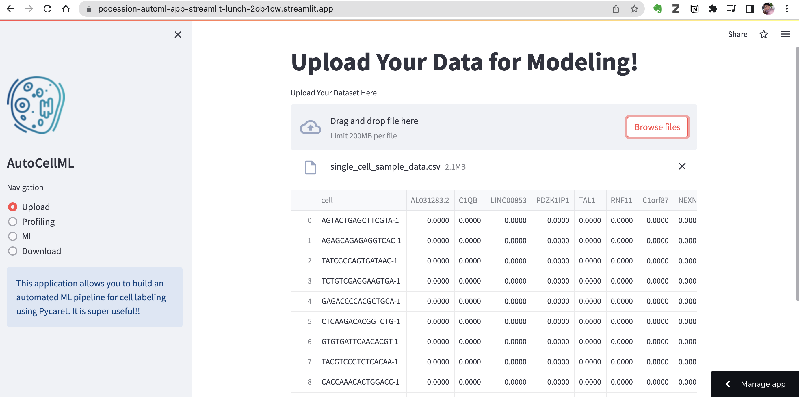

# AutoCellML: An automated ML pipeline for cell labeling using Streamlit

This application allows you to build an automated ML pipeline for cell labeling using Streamlit, Pandas profiling, and Pycaret. It is super useful!!

Can't image how easily to deploy an ML app in nowadays. Just write your app in python/streamlit and deploy the app in streamlit cloud. that's all!

I deploy a simple ML classifier for labeling cells based on single cell omics data. And it takes me ....... ONLY 20 MIN!! (Well ... the filtering, normalization, and optimization actually take days...).

As a bioinformatician, I feel sad because I did not learn this earlier. Those tools make people exchange their analysis result and accelerate the feedback process.

[APP](https://pocession-automl-app-streamlit-lunch-2ob4cw.streamlit.app/)
[github](https://github.com/pocession/automl)
[Credits](https://github.com/nicknochnack/AutoStreamlit/blob/main/requirements.txt)

