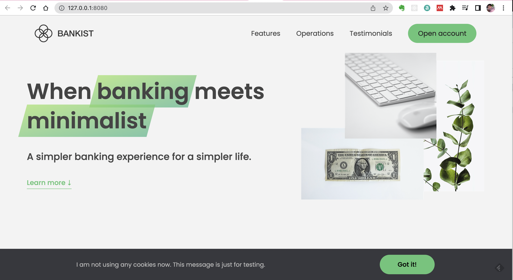

# Bankist: project for practicing my javascript skills

When working with people having different knowledge backgrounds, it is always important to use an interactive way to communicate and share data. Traditionally,bioinformatists use R markdown to share their discovery. However, it is not very interactive or dynamic enough. I'll start to learn JavaScript and aim to share data in a more interactive way. I took the Udemy course: "The Complete JavaScript Course 2022: From Zero to Expert!" and build several fancy websites. I decide to use the "Bankist" as a template to develop my own web application for sharing my bioinformatics discovery. In this project, I practiced several features that are needed for building a modern web application, including smooth scroll, sticky navigation, lazy loading, sliders, event delegation, and defer attribute.

