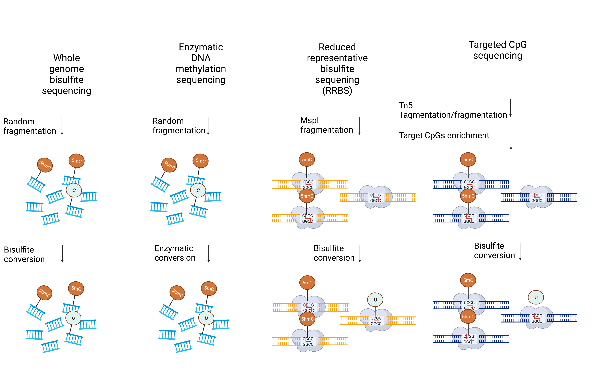

# A comparison of DNA methylation analysis methods

Environment factors such as microbiome can cause DNA methylation changes in genome wide scale, and thereby affect physiology, behavior, and even disease status of an organism. Whole genome bisulfite sequencing (WGBS) is a technique to help us profiling DNA methylation changes between different biological samples . Below is a simple comparison.

