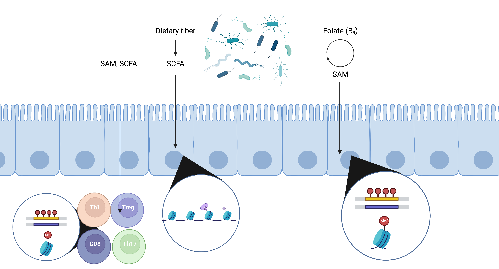

# Gut microbial metabolites affect host immunity through epigenetic modification

It is becoming clear that gut microbiota and their metabolites have profound influence on host immunity. Gut microbiota produce metabolites such as 
SCFA (short-chain fatty acid) or Folates that can modulate epigenetic modifications, thereby regulate the host gene expression. Here I review current findings.

## 1. SAM (S-adenosyl methionine) on IECs

SAM is the primary substrate for DNA and histone methylation. SAM is generated from folates or methionine, both of which are synthesized by gut microbiota. Researches also show gut microbiota promotes DNA methylation in genes required for antimicrobial response, such as *Tlr4* and *Cxcl16*. In the genome scale, the existence of gut microbiota decrease methylation levels and promotes the expression of antimcrobial genes in IECs, such as genes encoding antimicrobial peptide (1-3).

## 2. SCFA (Short-chain fatty acid) on IECs
SCFA are produced from fermentation of gut microbiota, including acetate (C2), propionate (C3), and butyrate (C4). SCFA could promotes histone acetylation through serving as acetyl donors or inhibiting HDAC (histone deacetylase) activities. The mechanism underlying the inhibition of HDAC by SCFA is still unclear, probably through acting as competitive inhibitors of HDAC. The influence of SCFA on epigenetic programming is not only limited in IECs, but can also extend to other tissues such as liver and adipose tissues. Genes affected by SCFA in IECs are mostly antimicrobial response and lipid metabolism (4-7).

## 3. SCFA on T cells
SCFA can directly affect histone acetylation in T cells. In regulatory T cells (Treg), SCFA can promotes histone 3 acetylation in the promoter region of *Foxp3* gene, and enhances Treg homeostasis. SCFA also also promotes the production of anti-inflammatory cytokine IL-10 in both Th1 and Th17 cells, although the detailed mechanism is unclear. Lastly, SCFA can help the formation of memory CD8+ T cells - cells that help to maintain long-term immunity against pathogens (8-15).

## Reference

1. Takahashi, Kyoko, Yutaka Sugi, Akira Hosono, and Shuichi Kaminogawa. "Epigenetic regulation of TLR4 gene expression in intestinal epithelial cells for the maintenance of intestinal homeostasis." The Journal of Immunology 183, no. 10 (2009): 6522-6529.
2. Olszak, Torsten, Dingding An, Sebastian Zeissig, Miguel Pinilla Vera, Julia Richter, Andre Franke, Jonathan N. Glickman et al. "Microbial exposure during early life has persistent effects on natural killer T cell function." Science 336, no. 6080 (2012): 489-493
3. Ansari, Ihab, Günter Raddatz, Julian Gutekunst, Meshi Ridnik, Daphne Cohen, Monther Abu-Remaileh, Timur Tuganbaev et al. "The microbiota programs DNA methylation to control intestinal homeostasis and inflammation." Nature microbiology 5, no. 4 (2020): 610-619.
4. Ansari, Ihab, Günter Raddatz, Julian Gutekunst, Meshi Ridnik, Daphne Cohen, Monther Abu-Remaileh, Timur Tuganbaev et al. "The microbiota programs DNA methylation to control intestinal homeostasis and inflammation." Nature microbiology 5, no. 4 (2020): 610-619.
5. Krautkramer KA, Kreznar JH, Romano KA, Vivas EI, Barrett-Wilt GA, Rabaglia ME, Keller MP, Attie AD, Rey FE, Denu JM, et al. Diet-microbiota interactions mediate global epigenetic programming in multiple host tissues. Mol Cell. 2016;64(5):982–992. doi:10.1016/j.molcel.2016.10.025. 
6. Kuang, Zheng, Yuhao Wang, Yun Li, Cunqi Ye, Kelly A. Ruhn, Cassie L. Behrendt, Eric N. Olson, and Lora V. Hooper. "The intestinal microbiota programs diurnal rhythms in host metabolism through histone deacetylase 3." Science 365, no. 6460 (2019): 1428-1434.
7. Alenghat, Theresa, Lisa C. Osborne, Steven A. Saenz, Dmytro Kobuley, Carly GK Ziegler, Shannon E. Mullican, Inchan Choi et al. "Histone deacetylase 3 coordinates commensal-bacteria-dependent intestinal homeostasis." Nature 504, no. 7478 (2013): 153-157.
8. Furusawa, Yukihiro, Yuuki Obata, Shinji Fukuda, Takaho A. Endo, Gaku Nakato, Daisuke Takahashi, Yumiko Nakanishi et al. "Commensal microbe-derived butyrate induces the differentiation of colonic regulatory T cells." Nature 504, no. 7480 (2013): 446-450.
9. Smith, Patrick M., Michael R. Howitt, Nicolai Panikov, Monia Michaud, Carey Ann Gallini, Mohammad Bohlooly-y, Jonathan N. Glickman, and Wendy S. Garrett. "The microbial metabolites, short-chain fatty acids, regulate colonic Treg cell homeostasis." Science 341, no. 6145 (2013): 569-573.
10. Obata, Yuuki, Yukihiro Furusawa, Takaho A. Endo, Jafar Sharif, Daisuke Takahashi, Koji Atarashi, Manabu Nakayama et al. "The epigenetic regulator Uhrf1 facilitates the proliferation and maturation of colonic regulatory T cells." Nature Immunology 15, no. 6 (2014): 571-579.
11. Luu, Maik, Sabine Pautz, Vanessa Kohl, Rajeev Singh, Rossana Romero, Sébastien Lucas, Jörg Hofmann et al. "The short-chain fatty acid pentanoate suppresses autoimmunity by modulating the metabolic-epigenetic crosstalk in lymphocytes." Nature communications 10, no. 1 (2019): 1-12.
12. Sun, Mingming, Wei Wu, Liang Chen, Wenjing Yang, Xiangsheng Huang, Caiyun Ma, Feidi Chen et al. "Microbiota-derived short-chain fatty acids promote Th1 cell IL-10 production to maintain intestinal homeostasis." Nature communications 9, no. 1 (2018): 1-15.
13. Zhang, Mingming, Lixing Zhou, Yuming Wang, Robert Gregory Dorfman, Dehua Tang, Lei Xu, Yida Pan et al. "Faecalibacterium prausnitzii produces butyrate to decrease c-Myc-related metabolism and Th17 differentiation by inhibiting histone deacetylase 3." International Immunology 31, no. 8 (2019): 499-514.
14. Zhou, Lixing, Mingming Zhang, Yuming Wang, Robert Gregory Dorfman, Hang Liu, Ting Yu, Xiaotian Chen et al. "Faecalibacterium prausnitzii produces butyrate to maintain Th17/Treg balance and to ameliorate colorectal colitis by inhibiting histone deacetylase 1." Inflammatory bowel diseases 24, no. 9 (2018): 1926-1940.
15. Bachem, Annabell, Christina Makhlouf, Katrina J. Binger, David P. de Souza, Deidra Tull, Katharina Hochheiser, Paul G. Whitney et al. "Microbiota-derived short-chain fatty acids promote the memory potential of antigen-activated CD8+ T cells." Immunity 51, no. 2 (2019): 285-297.

