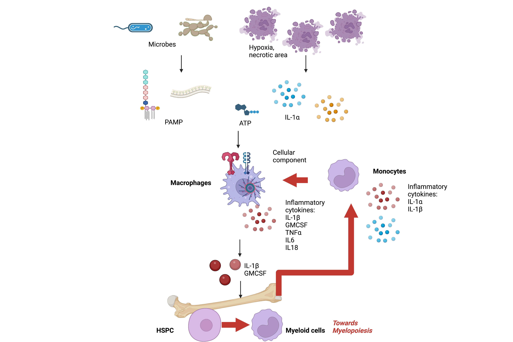

## IL-1 is the one!

Given there are so many pro-inflammatory cytokines, IL-1 is still the top of top: it initiates, amplifies, and educates the inflammation.

- Initiator: when pathogens cause tissue damages, cellular IL-1A could be released to extracellular environment. Meanwhile, immune cells hovering around the infected tissues also sense the pathogen-derived molecules and release IL-1B. Together, these two signals activate downstream inflammation.

- Amplifier: Pathogen-derived molecules such as LPS induce the synthesis of pro-IL-1B. However, the release of IL-1B is dependent on IL-1B itself. And yes - your guess is correct - this process forms a positive feedback loop of IL-1B synthesis, signaling, release, and inflammation.

- Educator: IL-1 directs the differentiation of HSPC in bone marrow, making the differentiation towards to myeloid cell lineages. It also has the potential to perform epigenetically reprogramming in genomics regions of TNFA, IL-6, and IL-18 in innate immune cells. The reprogrammed cells responds to pathogens immediately as they have "memory" - a process that now is entitled with "trained immunity".

* This figure is created by Biorender.

