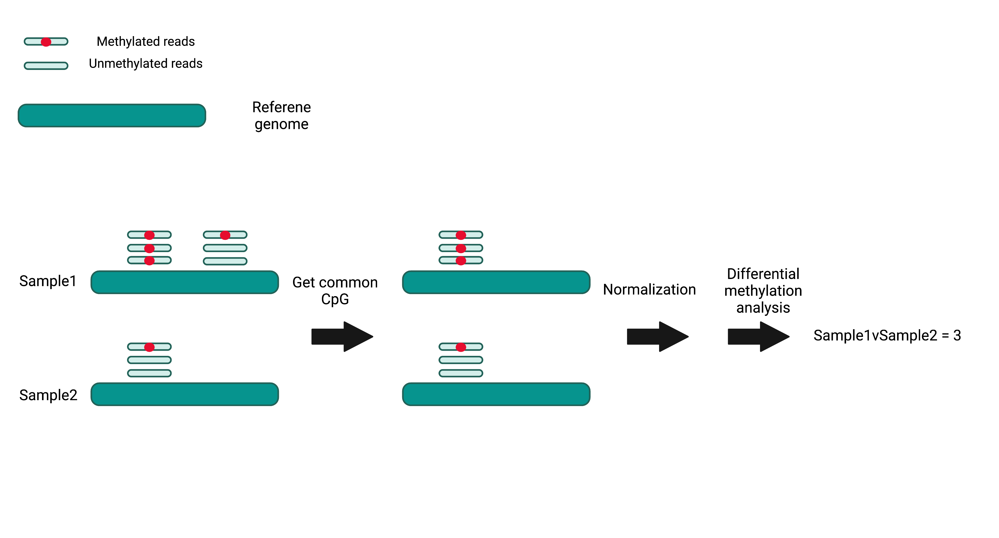

# Methylkit is a powerful tool for identifying DNA methylation differences between two groups.

To find out DNA methylation changes caused by experimental factors, e.g. presence of microbiome, aging, we need to compare the whole-genome DNA methylation status and identify the differentially-methylated regions (DMRs) between two groups. Methylkit is a powerful tool helping us to achieve this. A workflow of Methylkit package is shown here.

## Reference
1. Akalin, Altuna, Matthias Kormaksson, Sheng Li, Francine E. Garrett-Bakelman, Maria E. Figueroa, Ari Melnick, and Christopher E. Mason. "methylKit: a comprehensive R package for the analysis of genome-wide DNA methylation profiles." Genome biology 13, no. 10 (2012): 1-9.