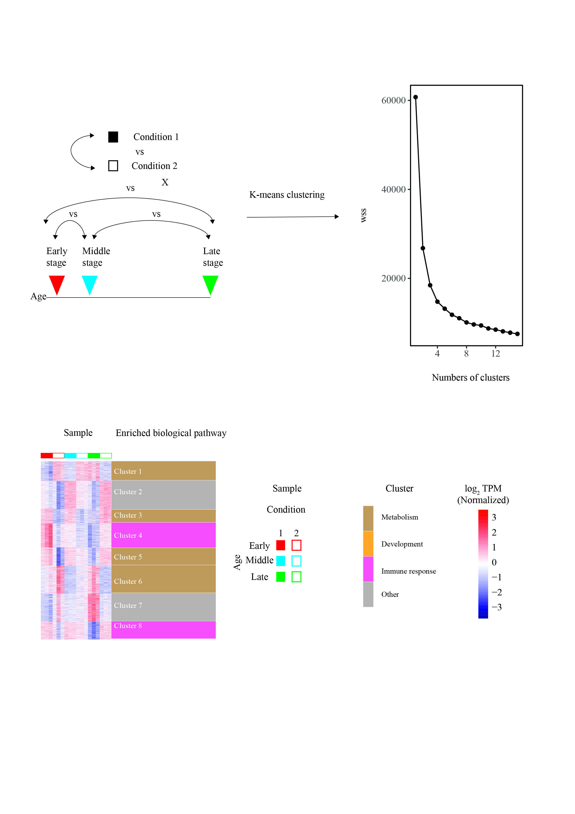

# A workflow of identifying Time-course differentially-expressed genes (TC-DEGs)

Changes in expression of genes depend not only on conditions, but also by times, are called time-course differentially-expressed genes (TC-DEGs). In our lab, we have established a workflow to identify TC-DEGs from a time-series RNAseq data between two conditions (e.g. KO vs WT, treatment vs control). This workflow first categorize TC-DEGs into several clusters by k-means clustering and perform pathways analysis to identify the enriched biological pathway for each cluster.

