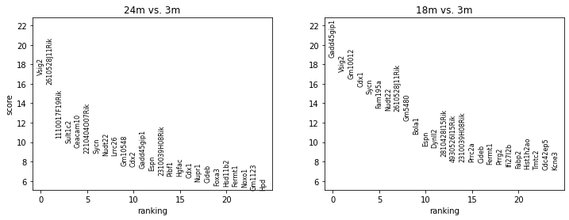
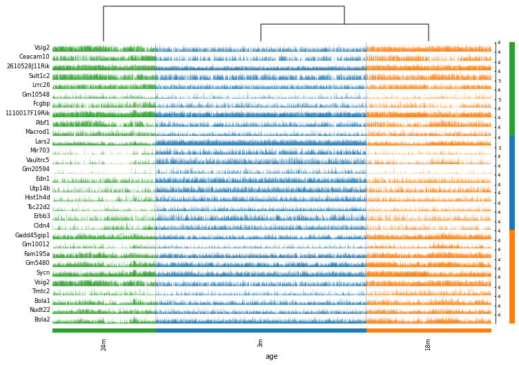

# Tabula_muris_Large_Intestine: a project for identifying aging-related biomarkers in large intestine through analyzing single cell transcriptome

Large intestine is the largest habitat for microbiomes as well as the largest immune organ. To identify aging-related biomarkers in single cell levels, I utilize Tabula muris senis - a public data set that records single-cell transcriptome in 20 organs/tissues thoughout the aging process. Here is a glimpse about the aging-related biomarkers in large intestine (pseudo bulk analysis).

- [Github](https://github.com/pocession/Tabula_muris)
