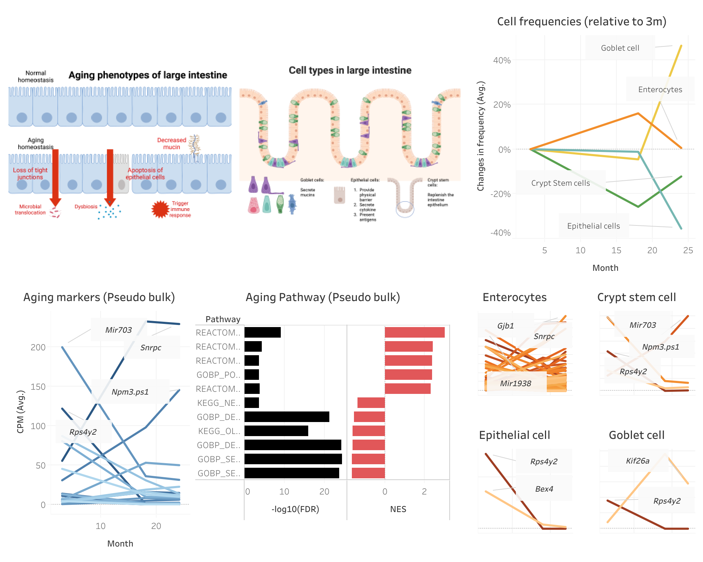

# Tabula_muris_Large_Intestine: a project for identifying aging biomarkers in large intestine in single cell level

Aging has profound influences on large intestine, including dysbiosis and increased immune stress. To reverse this process, we need to identify aging-related biomarkers in large intestine and target them. To this end, I explore the famous Tabula muris senis dataset - a public data set that records single-cell transcriptome in 20 organs/tissues throughout the aging process - and have identified aging biomarkers in both tissue and single cell level. Here is a glimpse about these biomarkers.

- [Github](https://github.com/pocession/Tabula_muris)
- [Tableau](https://public.tableau.com/app/profile/tsunghan.hsieh/viz/Tabula_muris_LargeIntestine/1#1)