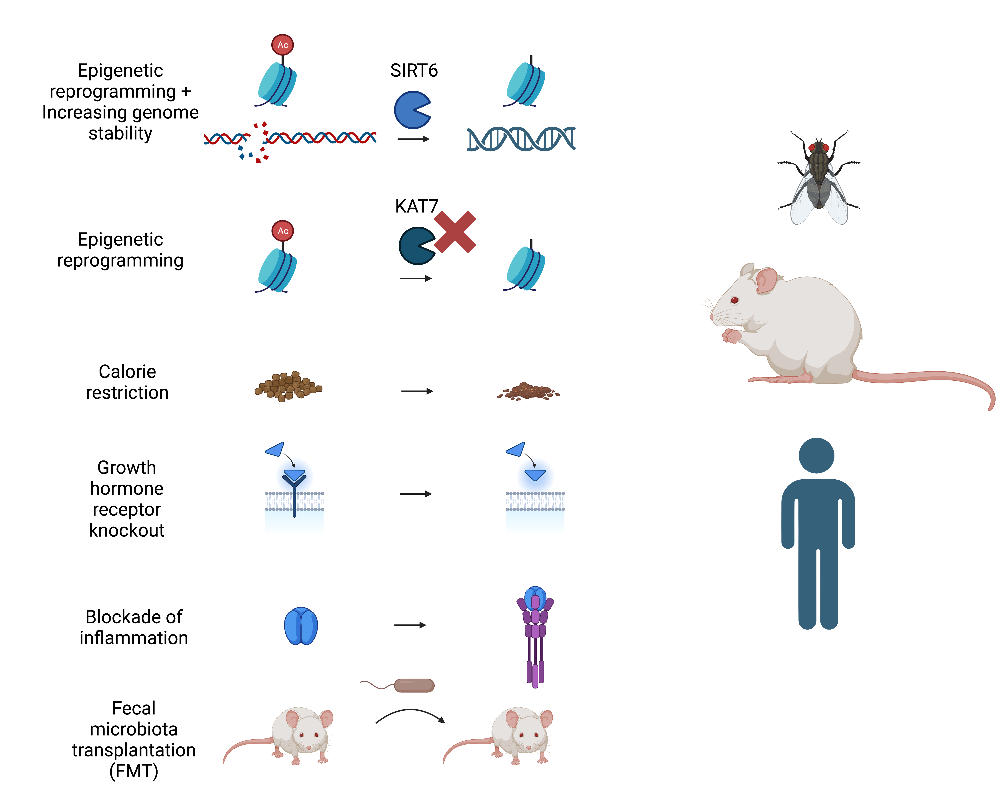

## Increasing the lifespan
The oldest and most fascinating topic in life science is definitely how to increase our lifespan. Thanks for decades of research, we have a much more understanding than the past century.

1. Stabilizing genome: overexpression of enzyme such as SIRT6 could reduce DNA breaks and increase genome stability.
2. Epigenetic reprogramming: inhibition of KAT7 or overexpression of SIRT6 could reduce the acetylation level of histones and lead to an increased lifespan.
3. About 30% calorie restriction increases the lifespan of mice.
4. Inhibition of growth hormone also lead to calorie restriction and increases the lifespan of mice.
5. Blocking the source of chronic inflammation such as TNFA increases the lifespan.
6. Transfer of specific microbiota such as A. muciniphila and L. plantarum GKM3 from wild type mice to aged mise model promote the lifespan.

#aging #immunology #research

- Credit - information is obtained from this [review](https://www.sciencedirect.com/science/article/abs/pii/S0092867422013770).
- This figure is created by Biorender.

