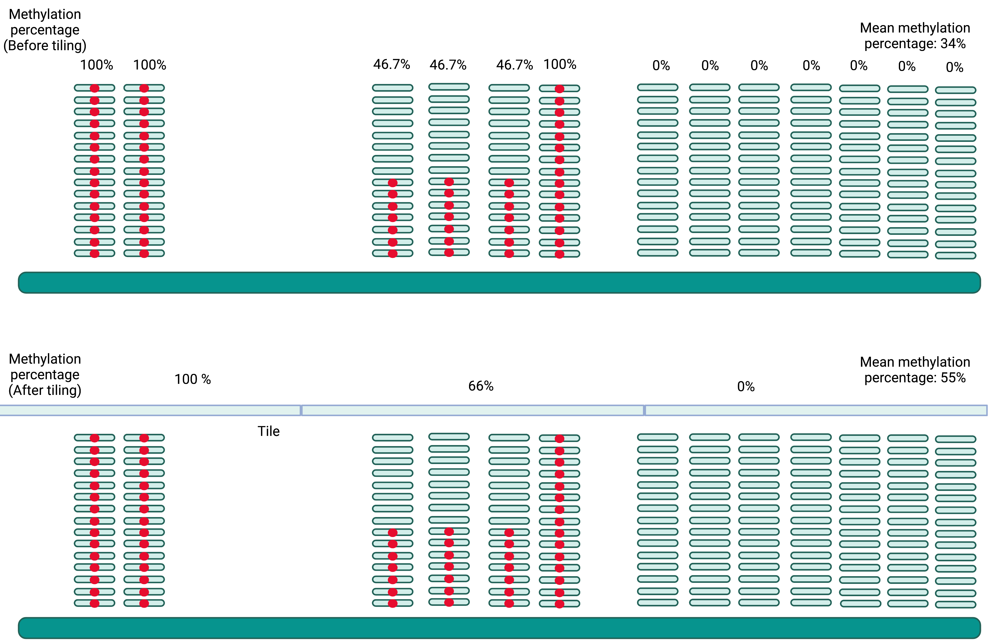

# Tiling is the trick for summarizing methylation information in a specific genomic region and reducing the calculation power.

Genome-wide DNA methylation profiling is usually shown in single-base resolution. However, to gain further  insight, it is better to generate methylation profiling by summarizing methylation levels within a fixed number of base pairs (bp) (1). For example, to understand the genome-wide DNA methylation profiling in transcription factor binding sites, methylation levels within 20 bp needs to be first gathered into a "tile". A representative methylation level of this 20-bp tile will be calculated and normalized with other tiles across the genome (2). Tiling length varies according on the features. 1000-bp is good for showing methylation levels in promoter regions but 200bp are necessary for discussing chromatin states (3). Here is a summary for the genomic tiling process.

## Reference
1. Smith, Zachary D., Michelle M. Chan, Tarjei S. Mikkelsen, Hongcang Gu, Andreas Gnirke, Aviv Regev, and Alexander Meissner. "A unique regulatory phase of DNA methylation in the early mammalian embryo." Nature 484, no. 7394 (2012): 339-344.
2. Tompa, Martin, Nan Li, Timothy L. Bailey, George M. Church, Bart De Moor, Eleazar Eskin, Alexander V. Favorov et al. "Assessing computational tools for the discovery of transcription factor binding sites." Nature biotechnology 23, no. 1 (2005): 137-144.
3. Kharchenko, Peter V., Artyom A. Alekseyenko, Yuri B. Schwartz, Aki Minoda, Nicole C. Riddle, Jason Ernst, Peter J. Sabo et al. "Comprehensive analysis of the chromatin landscape in Drosophila melanogaster." Nature 471, no. 7339 (2011): 480-485.