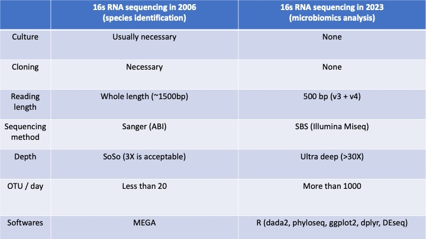

# Life changes!
Recently I am playing microbial genomics analysis, and it reminds me what I was doing during my master (17-yr ago!!) - novel species identification for environmental bacteria. This table does tell me how the technology improves and reshape my research life :).

